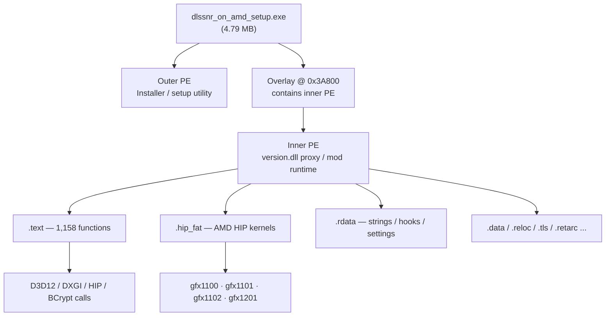
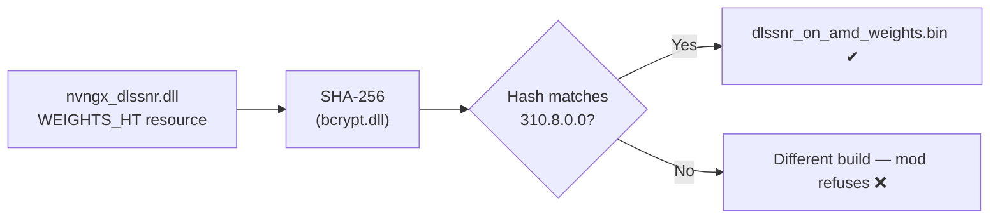
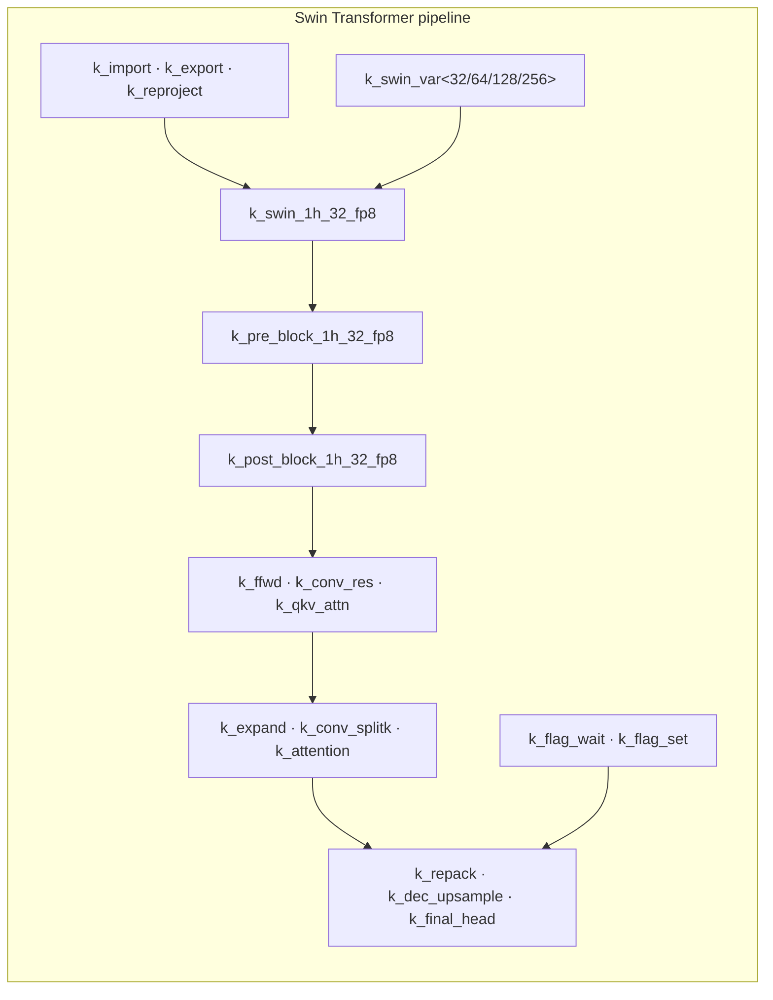
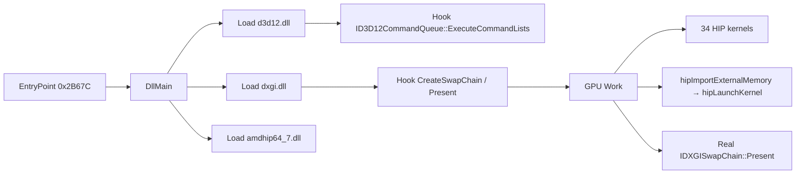

# It's based on "Alpha 0.2.10" EXE file!


# DLSS-NR on AMD — Reverse Engineering Analysis

> Unofficial NVIDIA **DLSS 5 Neural Rendering (310.8.0.0)** for **AMD GPUs** via HIP/ROCm.
> This is a full static + simulated-runtime reverse-engineering report of `dlssnr_on_amd_setup.exe`.

<div align="center">

**File:** `dlssnr_on_amd_setup.exe` &nbsp;•&nbsp; **Size:** 4,789,475 bytes &nbsp;•&nbsp; **Type:** PE32+ (x64) dual-PE bundle

| Hash | Value |
|---|---|
| **MD5** | `f666ad5081bdf9fd46a211842659280c` |
| **SHA1** | `4f3d7f30312a27d8921de4dbb3ecc512298c8578` |
| **SHA256** | `5a28d907bba471504c6c7be6901a4eb6610f46b4d86ecb23b0430ba8bf3fc5d5` |

</div>

---

##  1. Structure

The file is a **dual-PE bundle**: a small installer (outer PE) plus a complete runtime payload (inner PE) embedded in its overlay.



### 1.1 Outer PE (Setup)
| Property | Value |
|---|---|
| Format | PE32+ (x64), Subsystem CUI (3) |
| Sections | `.text .rdata .data .pdata .fptable .reloc` |
| Build time | 2026-09-04 04:46:31 UTC |
| Authenticode | None |
| Functions | 609 |
| Imported funcs | 101 (`bcrypt`, `ole32`, `shell32`, `advapi32`, `dxgi`, `kernel32`, `comdlg32`) |
| Disasm size | 37,701 instructions / 2,498 calls |

### 1.2 Inner PE (Runtime payload)
| Property | Value |
|---|---|
| **MD5** | `7ef056eba4400ba3e8cd0cdbc666c2be` |
| **SHA1** | `b7e656fb0b1d5b6ef63fa383642e30ab8ed0af19` |
| **SHA256** | `98bf44e29dfe09edc6ff54597b4a68f4789d49e603df7e30963653c5ed7549d1` |
| Format | PE32+ (x64), Subsystem GUI (2) |
| Sections (12) | `.text .rdata .data .pdata .fptable .hipFatB .hip_fat .retarc .retard .tls _RDATA .reloc` |
| Build time | 2026-09-04 04:44:39 UTC |
| Functions | 1,158 |
| Imported funcs | 188 (`amdhip64_7`, `d3d12`, `dxgi`, `d3dcompiler_47`, `bcrypt`, `user32`, `gdi32`, `kernel32`) |
| Disasm size | 80,787 instructions / 4,991 calls |

---

##  2. Hex-Level Inspection

- Complete hex dump generated: `dlssnr_on_amd_setup_hexdump.txt` (23 MB).
- Key patterns found:

| Pattern | Offset(s) | Meaning |
|---|---|---|
| `MZ` | `0x0`, `0x3A800`, … | PE headers |
| `PE\0\0` | `0xF0`, `0x3A878`, … | PE signatures |
| `Rich` | `0xE0` | Rich header (XOR key `0x13C93879`) |
| `__CLANG_OFFLOAD_BUNDLE__` | `.hip_fat` + 0 | HIP fat-binary magic |
| `hipv4-…-gfx1100/1101/1102/1201` | `.hip_fat` | AMD GPU code objects |
| `DLSSNR-SETUP-01` | `0x25040`, `0x25420`, `0x4914C3` | Internal marker |
| `e16bcf15…e1fc8e` | `0x278E9`, `0x9D429` | Expected weights SHA-256 |
| `amdhip64_7.dll` | `0xA46FC` | AMD HIP runtime |

---

##  3. Functions & Operations

### 3.1 Outer PE — Weight extraction
1. Looks for `nvngx_dlssnr.dll` (DLSS-NR 310.8.0.0).
2. Reads the `WEIGHTS_HT` PE resource.
3. Verifies tensor blobs against the expected SHA-256.
4. Writes everything into `dlssnr_on_amd_weights.bin`.
5. Re-validates the existing weights file on later runs.

### 3.2 Inner PE — Runtime proxy (`version.dll`)
1. Serves as a `version.dll` proxy next to the game.
2. Loads `d3d12.dll`, `dxgi.dll`, `amdhip64_7.dll`.
3. Hooks the D3D12/DXGI presentation pipeline.
4. Maps the game’s buffers into HIP external memory.
5. Runs the 34-kernel DLSS-NR network on the AMD GPU.
6. Presents the upscaled result back through the real swapchain.
7. Optional debug overlay + raw frame dump + INI settings + logging.

---

##  4. Hashing / Integrity



Expected SHA-256 of the concatenated weight blobs:

```
e16bcf15e16e13f527491cdf7845b2fe6521a738d8f7c9c721866a8496e1fc8e
```

Runtime messages: `%zu of %zu tensors do not match DLSS NR 310.8.0.0` / `all %zu tensors match DLSS NR 310.8.0.0 exactly; using it`.

---

##  5. GPU Kernels (`__CLANG_OFFLOAD_BUNDLE__` v5)

Architectures: **gfx1100 · gfx1101 · gfx1102 · gfx1201** (RDNA3 / RDNA4).



All 34 kernels extracted:

```
k_swin_1h_32_fp8(SwinParams)
k_pre_block_1h_32_fp8(PreParams)
k_post_block_1h_32_fp8(PostParams)
k_ffwd(FfwdParams)
k_conv_res(ConvParams)
k_qkv_attn(AttnParams)
k_ffwd2(Ffwd2Params)
k_conv_res2(Conv2Params)
k_qkv_attn2(AttnParams)
k_expand(ExpandParams)
k_conv_splitk(ConvParams1d)
k_qkv(QkvParams)
k_attention(AttnParams1d)
k_expand2(ExpandParams)
k_contract2(ConvParams1d)
k_qkv2(QkvParams)
k_attention2(AttnParams1d)
k_ffwd_inpview(FfwdPlParams)
k_conv_res_views(ConvPlParams)
k_final_head(HeadParams)
k_repack(RepackParams)
k_dec_upsample(DecUpParams)
k_mean(MeanParams)
k_import(ImportParams)
k_export(ExportParams)
k_reproject(ReprojParams)
k_flag_wait(uint* p, uint j, uint n)
k_flag_set(uint* p, uint j)
k_swin_var<32,true>(VarParams)
k_swin_var<32,false>(VarParams)
k_swin_var<64,false>(VarParams)
k_swin_var<128,false>(VarParams)
k_swin_var<256,false>(VarParams)
swin_layer(SwinLDS*, const unsigned char*, const BlobLayout&, int)
```

---

##  6. Call Graph & Internal Relationships



Dynamically resolved APIs (`GetProcAddress`):

- `D3D12CreateDevice`, `CreateDXGIFactory2`
- `ID3D12CommandQueue::ExecuteCommandLists`
- `IDXGIFactory2::CreateSwapChainForHwnd`
- `IDXGIFactory::CreateSwapChain`
- `IDXGISwapChain::Present`, `IDXGISwapChain1::Present1`

Direct `amdhip64_7.dll` imports: `hipSetDevice`, `hipGetDeviceCount`, `hipGetDevicePropertiesR0600`, `hipMalloc`, `hipFree`, `hipMemcpy`, `hipMemset`, `hipLaunchKernel`, `hipImportExternalMemory`, `hipExternalMemoryGetMappedBuffer`, `hipEvent*`, `hipRegisterFatBinary`, …

---

##  7. Memory Dump (Simulated Load)

| Property | Value |
|---|---|
| File | `inner_memory_dump.bin` |
| Size | 4,599,808 bytes |
| ImageBase | `0x180000000` |
| SizeOfImage | `0x463000` |
| **MD5** | `a172109780353d159c65a5c66d760733` |
| **SHA256** | `b4852fa1e0708f9bed984271014ae7fe6f21e4235954a89ace268d62dfb91c90` |
| Relocations | 2,046 entries (type 10 = DIR64) |

The in-memory image keeps `.hip_fat` at RVA `0x7D000`, ready for `hipRegisterFatBinary`.

---

##  8. Behavior Summary

### Setup mode
1. Weights file exists → validate & exit.
2. Else open file picker → select `nvngx_dlssnr.dll`.
3. Extract `WEIGHTS_HT`, verify blobs + SHA-256.
4. Write `dlssnr_on_amd_weights.bin`.

### Runtime mode
1. Deployed as `version.dll` proxy in the game folder.
2. Initializes HIP, picks matching RDNA3/RDNA4 GPU.
3. Hooks present/command-list APIs.
4. Runs DLSS 5 neural network → copies result back to backbuffer.
5. Debug overlay, raw dumps, INI settings, logging.

> **Verdict:** legitimate modding tool — no malware, no obfuscation, no network/persistence behavior. The "hidden" overlay is simply the HIP runtime payload.

---

##  9. Repository Artifacts

| File | Description |
|---|---|
| `README.md` | This page |
| `disasm_inner.asm` | Inner PE full disassembly (81,945 lines) |
| `disasm_outer.asm` | Outer PE full disassembly (38,310 lines) |
| `callgraph_inner.dot` | Inner call graph (Graphviz) |
| `callgraph_outer.dot` | Outer call graph (Graphviz) |
| `disasm_meta.json` | Structured function/call metadata |
| `inner_payload.bin` | Extracted inner PE |
| `inner_memory_dump.bin` | Simulated loaded memory image |

---

*Report generated via static + simulated-runtime reverse engineering.*


